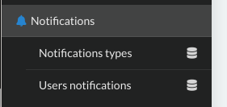
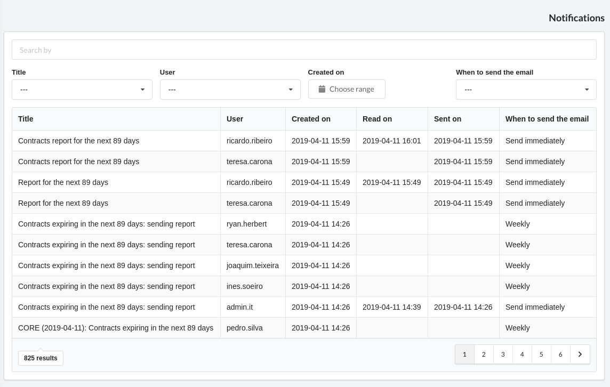
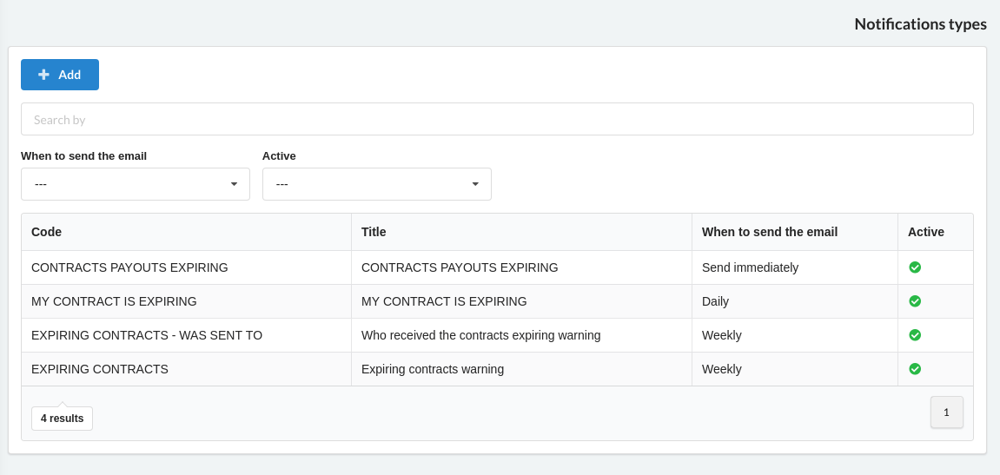
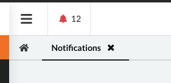
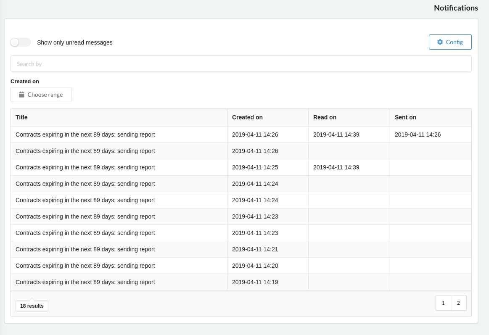
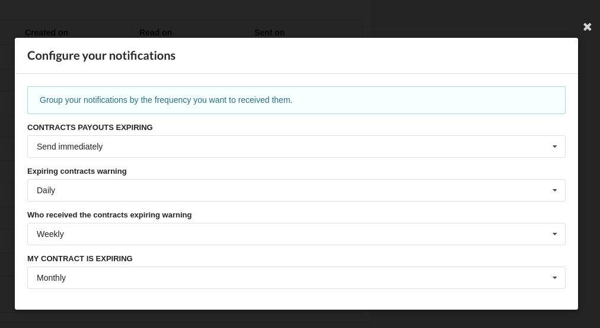

# Notification central


This module manages the user email notifications and aims to reduce the amount of emails sent to the users.
Users can now group their notifications on a single email that can be send daily, weekly or monthly. 

##How to configure

Add the module to the installed apps in django settings, and execute the migration command.

```python
INSTALLED_APPS = [
    'notifications',
    ...
]
```

##How it works

### In the code

```python
from notifications.tools import notify

...

notify('CODE OF THE NOTIFICATION', msg_subject, msg_text, user=user_to_send)

```


###On the Web App

####Superuser view








#### Users









